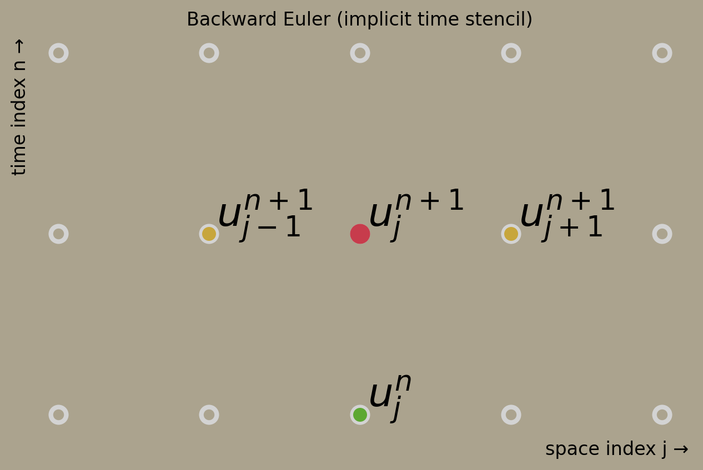

# Backward Euler diffusion solver (BE)

This page documents the numerical method used in the **Backward Euler (BE)**
permeation solver implemented in this project.  
It serves as a **reference anchor** for the solver design, terminology, and
implementation choices.

---

## Backward Euler stencil

Consider the 1D diffusion equation

\[
\frac{\partial u}{\partial t} = D \frac{\partial^2 u}{\partial x^2}.
\]

Using **Backward Euler** in time and **second-order central differences** in space, we write

\[
\frac{u_j^{n+1} - u_j^n}{\Delta t}
= D \, \frac{u_{j+1}^{n+1} - 2u_j^{n+1} + u_{j-1}^{n+1}}{\Delta x^2}.
\]

Rearranging,

\[
-\alpha\, u_{j-1}^{n+1}
+ (1 + 2\alpha)\, u_j^{n+1}
- \alpha\, u_{j+1}^{n+1}
= u_j^n,
\qquad
\alpha = D\,\frac{\Delta t}{\Delta x^2}.
\]

<figure markdown>
  { width="80%" }
</figure>

### Interpretation

- All spatial points at the **new time level \(n+1\)** appear on the left-hand side.  
  They are **unknown** and must be solved **simultaneously**.
- Values at time level **\(n\)** appear only on the right-hand side and are **known data**.
- In 1D, this leads to a **tridiagonal linear system** at each time step.

### Key properties

- **Implicit in time** → requires solving a linear system
- **Unconditionally stable** for diffusion problems
- **First-order accurate** in time, **second-order** in space

### Visual intuition

A stencil diagram for this scheme can be generated with the package viz helper (see [examples](https://github.com/queezz/PermeationFit/tree/main/examples) notebook `backward-euler-stencil.ipynb` or `permeation.viz.plot_grid_stencil` with `mode="time"`). In the diagram:

| Color  | Meaning | Node |
|--------|--------|------|
| **Green**  | Known value (previous time step) | \(u_j^n\) |
| **Yellow** | Coupled unknowns (same time level) | \(u_{j\pm1}^{n+1}\) |
| **Red**    | Focal unknown (center)            | \(u_j^{n+1}\) |

All **yellow** and **red** nodes belong to the same solve at time \(n+1\), which is the defining feature of the Backward Euler method.

---

## Time integration

### Backward Euler

- **Type:** fully implicit, first-order in time
- **Used for:** time integration of the diffusion equation

The diffusion equation is discretised in time as:

\[
\frac{u^{n+1} - u^n}{\Delta t}
=
D \frac{\partial^2 u^{n+1}}{\partial x^2}
\]

This leads to a linear system of the form:

\[
(I - \Delta t\,D\,L)\,u^{n+1} = u^n
\]

where \(L\) is the discrete Laplacian operator, and \(I\) is identity operatro, see [notation](../reference/notation.md#operators-and-matrices)

**References**

- [Backward Euler method](https://en.wikipedia.org/wiki/Backward_Euler_method){ target=_blank }
- [Implicit methods](https://en.wikipedia.org/wiki/Implicit_method){ target=_blank }

---

## Spatial discretisation

### Central finite differences

- **Grid:** uniform, one-dimensional
- **Order:** second-order accurate in space
- **Operator:** three-point stencil for the second derivative

Used to discretise the Laplacian in the diffusion equation.

**References**

- [Finite difference method](https://en.wikipedia.org/wiki/Finite_difference_method){ target=_blank }
- [Discrete Laplacian](https://en.wikipedia.org/wiki/Discrete_Laplacian){ target=_blank }

---

## Linear system solution

### Sparse tridiagonal system

Each time step requires solving a sparse tridiagonal linear system resulting
from the implicit diffusion operator.

- Matrix assembly: `scipy.sparse.diags`
- Linear solver: `scipy.sparse.linalg.spsolve`

**References**

- [SciPy sparse matrices](https://docs.scipy.org/doc/scipy/reference/sparse.html){ target=_blank }
- [Tridiagonal matrix algorithm](https://en.wikipedia.org/wiki/Tridiagonal_matrix_algorithm){ target=_blank }

---

## Boundary conditions

### Nonlinear recombination boundary conditions

At the upstream and downstream boundaries, the flux depends quadratically on
the local concentration:

\[
\Gamma \propto u^2
\]

This introduces nonlinearity only at the boundaries; the interior diffusion
equation remains linear.

---

## Nonlinear treatment

### Picard (fixed-point) iteration

The nonlinear boundary terms are handled using Picard iteration:

\[
u^2 \;\approx\; a \cdot u
\]

where the coefficient \(a\) is taken from the previous iterate.  
The resulting linear system is solved repeatedly until convergence.

An explicit predictor is used only to initialise the boundary values before
iteration.

**References**

- [Picard iteration](https://en.wikipedia.org/wiki/Picard_iteration){ target=_blank }
- [Fixed-point iteration](https://en.wikipedia.org/wiki/Fixed-point_iteration){ target=_blank }
- [Picard's iteration method](https://adamdjellouli.com/articles/numerical_methods/7_ordinary_differential_equations/picards_method){ target=_blank}

---

## Notes

- The scheme is unconditionally stable with respect to the diffusion CFL
  condition.
- Numerical damping of fast transients is expected (typical for Backward Euler).
- Nonlinearity is confined to the boundary treatment.

Stencil diagrams are generated with `permeation.viz.plot_grid_stencil(..., mode="time")`; see the [examples](https://github.com/queezz/PermeationFit/tree/main/examples) folder for the Backward Euler stencil notebook.
